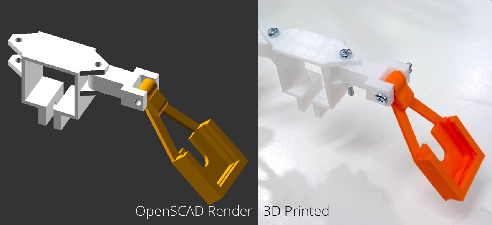

# RPi Scanner Case

3D scanner unit using a Raspberry Pi and standard RPi cameras.
Mounts on a square bar. Angles are adjustable. Designed to work with standard M3
screws and nuts (also adjustable in settings)

## Mounting System

Contains the bar clip and intermediate arm.

## RPi Camera

Holds the camera, attaches to intermediate arm.

## RPi Case

Modified from chamber cases, with more space to fit camera shields.
